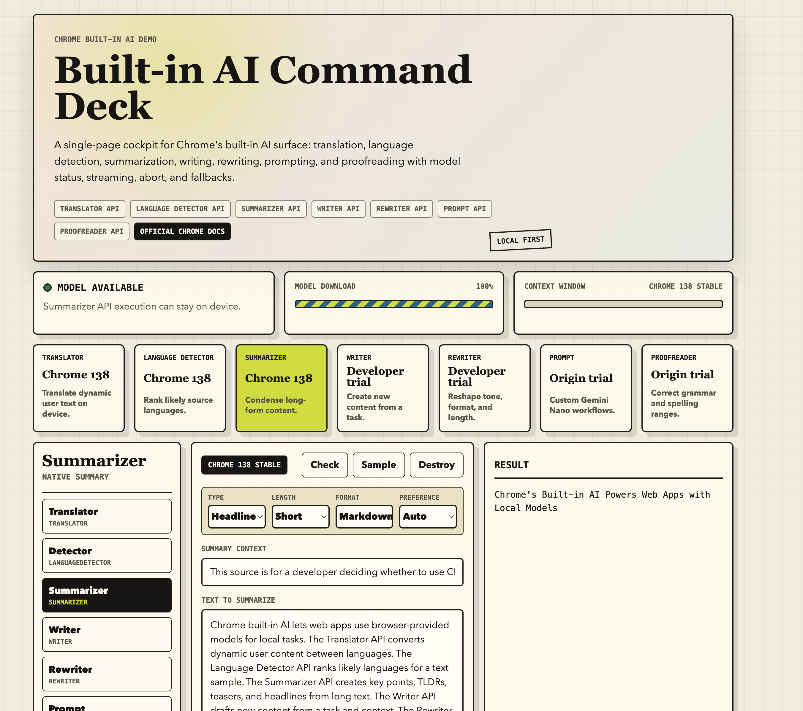

# Chrome Built-in AI Command Deck

A single-page demo for Chrome's built-in AI APIs. It gives you one cockpit for trying translation, language detection, summarization, writing, rewriting, prompting, and proofreading directly in the browser.

The demo is intentionally static: no build step, no framework, no server-side API, and no external model calls from the app. Open it on `localhost`, enable the required Chrome features, and test whichever native browser APIs your Chrome build exposes.



## Live Demo

https://chrome-built-in-ai-command-deck.vercel.app

## Live Scope

This project showcases the current Chrome built-in AI surface described in the official Chrome documentation:

https://developer.chrome.com/docs/ai/built-in-apis

Covered APIs:

| API | Browser global | Demo capability | Status shown in app |
| --- | --- | --- | --- |
| Translator API | `Translator` | Translate text between language pairs | Chrome 138 stable |
| Language Detector API | `LanguageDetector` | Rank likely input languages with confidence | Chrome 138 stable |
| Summarizer API | `Summarizer` | Generate key points, TLDRs, teasers, or headlines | Chrome 138 stable |
| Writer API | `Writer` | Draft new content from a writing task and context | Developer trial |
| Rewriter API | `Rewriter` | Rewrite text by tone, format, or length | Developer trial |
| Prompt API | `LanguageModel` | Run custom Gemini Nano prompts and JSON-constrained tasks | Origin trial / extensions |
| Proofreader API | `Proofreader` | Correct text and display correction ranges | Origin trial |

## What The Demo Does

- Checks native API availability with each API's browser global.
- Creates browser-native API sessions when available.
- Shows model download progress when Chrome reports it.
- Streams output for APIs that expose streaming methods.
- Falls back to deterministic local demo output when an API is missing.
- Shows the active code pattern for the selected API.
- Lets you destroy sessions and recreate them cleanly.
- Keeps the app usable even when only some APIs are enabled in Chrome.

## Run Locally

From the repo root:

```bash
python3 -m http.server 4173
```

Then open:

```text
http://127.0.0.1:4173/
```

Use `localhost` or `127.0.0.1`. Do not judge the APIs through a raw `file://` URL.

## Chrome Setup

Use Chrome desktop. Some APIs are stable, some require origin trials, developer trials, EPP access, or flags.

Common local flags to check:

```text
chrome://flags/#optimization-guide-on-device-model
chrome://flags/#prompt-api-for-gemini-nano
chrome://flags/#prompt-api-for-gemini-nano-multimodal-input
chrome://flags/#proofreader-api-for-gemini-nano
```

Chrome flag names shift as APIs move through trials. If a specific flag is missing, search `chrome://flags` for the API name, for example `summarizer`, `writer`, `rewriter`, `proofreader`, `prompt`, or `gemini nano`.

After changing flags, relaunch Chrome.

## Runtime Requirements

Chrome's built-in AI APIs have hardware, storage, browser-version, and network requirements. In practical terms:

- Use Chrome desktop.
- Keep enough free disk space for model downloads.
- Use an unmetered network for the initial model download.
- Expect different API availability across Stable, Canary, extensions, origin trials, developer trials, and EPP builds.
- Expect some APIs to be unavailable even when others work.

The app handles this by showing status and fallback output instead of crashing.

## API Modes

### Translator

Select a source language and target language, then translate the input text.

Native path:

```js
const translator = await Translator.create({
  sourceLanguage: "en",
  targetLanguage: "es",
});

const result = await translator.translate(text);
```

### Language Detector

Provide text and optional expected language candidates. The app renders ranked language candidates and confidence scores.

Native path:

```js
const detector = await LanguageDetector.create({
  expectedInputLanguages: ["en", "es", "fr", "de", "ja"],
});

const results = await detector.detect(text);
```

### Summarizer

Choose summary type, length, format, and preference. The app uses streaming when available.

Native path:

```js
const summarizer = await Summarizer.create({
  type: "key-points",
  format: "markdown",
  length: "short",
});

const summary = await summarizer.summarize(text);
```

### Writer

Provide a writing task and context. Choose tone, length, and format.

Native path:

```js
const writer = await Writer.create({
  tone: "formal",
  format: "markdown",
  length: "medium",
});

const draft = await writer.write(task, { context });
```

### Rewriter

Provide source text and a rewrite goal. Choose tone, length, and format.

Native path:

```js
const rewriter = await Rewriter.create({
  tone: "more-formal",
  format: "plain-text",
  length: "shorter",
});

const rewritten = await rewriter.rewrite(text, { context });
```

### Prompt

Use preset Prompt API tasks:

- Search: answer from source text.
- Filter: return a boolean classification.
- Event: extract calendar JSON.
- Contact: extract contact JSON.

Native path:

```js
const session = await LanguageModel.create({
  expectedInputs: [{ type: "text", languages: ["en"] }],
  expectedOutputs: [{ type: "text", languages: ["en"] }],
});

const result = await session.prompt(prompt);
```

### Proofreader

Proofread text and render corrected text plus correction ranges.

Native path:

```js
const proofreader = await Proofreader.create({
  expectedInputLanguages: ["en"],
});

const result = await proofreader.proofread(text);
```

## Verification

Run the test suite:

```bash
node --test prompt-lab.test.mjs
```

Check JavaScript syntax:

```bash
node --check prompt-lab.js
```

The tests cover option builders, fallback behavior, response formatting, Prompt API prompt construction, JSON constraints, detection rendering, and header documentation requirements.

## Project Structure

```text
.
|-- index.html           # Static app shell and controls
|-- styles.css           # Responsive editorial/console UI
|-- prompt-lab.js        # Native API controller, fallbacks, helpers
`-- prompt-lab.test.mjs  # Node test suite
```

## Design Notes

The app is built as a static browser demo because the APIs are browser features. A framework would add noise here. The important work is capability detection, graceful degradation, and a UI that makes partial browser support obvious.

The fallback outputs are deterministic. They are not trying to impersonate Gemini Nano. They exist so the interface remains demonstrable when an API is not exposed in the current Chrome profile.

## Limitations

- Native API support depends on your Chrome version, flags, trials, and hardware.
- Some APIs are experimental and may change shape.
- Some availability calls differ across Chrome channels, so the app includes conservative `TypeError` fallbacks.
- This demo is not a production abstraction layer. It is a focused browser capability lab.

## References

- Chrome built-in AI APIs: https://developer.chrome.com/docs/ai/built-in-apis
- Built-in AI setup and requirements: https://developer.chrome.com/docs/ai/get-started
- People + AI Guidebook: https://pair.withgoogle.com/guidebook/
